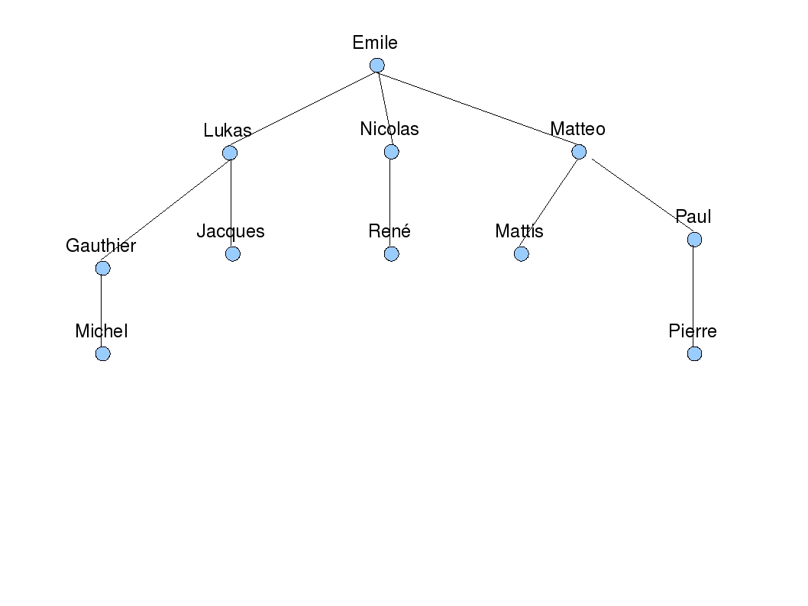

# TP1.1 Bases de XML

L'objectif de ce TP est de se familiariser avec les notions suivantes :
- Annotation descriptive et balisage
- Structuration de document
- Syntaxe de XML
- XML bien formé
- DTD

## Exercice 1 - Structuration de documents
XML permet de structurer un document selon les informations qu'il contient. Il est donc nécessaire, avant d'envisager d'utiliser ce format, de se familiariser avec le problème de la structuration en lui-même.

### 1.1 Structuration d'information
Le texte suivant contient de l'information 'en vrac' :

> Le système solaire est composé d'une étoile, le Soleil, et des objets définis gravitant autour de lui: 
> les huit planètes et leurs satellites naturels, les cinq planètes naines, et les milliards de petits corps (astéroïdes, objets glacés, comètes, météorites, poussière interplanétaire, etc.). 
> les planètes du système se nomment Mercure, Vénus, la Terre, Mars, Jupiter, Saturne, Uranus et Neptune. 
> Les quatre premières se sont des planètes telluriques internes et les autres sont des géantes gazeuses externes. 
> Six de ces planètes (sauf mercure et venus) possèdent des satellites en orbite et chacune des planètes externes est entourée d’un anneau planétaire de poussière et d’autres particules. 
> Les quatre planètes internes sont composées en grande partie de minéraux à point de fusion élevé, tels les silicates, et de métaux comme le fer et le nickel. 
> Trois des quatre planètes (Vénus, la Terre et Mars) ont une atmosphère substantielle. 
> L’atmosphère de Mercure est formée d’atomes arrachés à sa surface par le vent solaire, alors que l’atmosphère de Vénus et Mars est très riche en gaz carbonique. 
> Les quatre planètes externes sont des géantes gazeuses. Jupiter et Saturne sont principalement constituée (ainsi leur atmosphère) d'hydrogène et d'hélium ; tandis que Uranus et Neptune contient un plus grand pourcentage de glaces. 
> Les quatre géantes gazeuses possèdent des systèmes d'anneaux, mais seuls ceux de Saturne peuvent être facilement observés depuis la Terre. 
> L’atmosphère terrestre est radicalement différente de celle des autres planètes, ayant été altérée par la présence de formes de vie pour contenir 21 % d’oxygène.

1. Réorganiser l'information sans format particulier de manière à mettre en évidence sa structure logique. En s'attachant à ne perdre aucune information par rapport à la source d'information initiale (le texte).
2. Puis transformer cette structure logique sous forme d'un document XML.
3. Commenter la possibilité de structurer directement le texte (faisabilité, difficultés...).

### 1.2 Description de texte
Nous cherchons à décrire le texte de ce sujet de TP lui-même (ce que vous lisez en ce moment). 

Proposer un document XML qui rende compte de son organisation hiérarchique (inutile de recopier l'intégralité du texte, remplacer par des extraits).

## Exercice 2 - Quelques recherches sur la syntaxe XML

Répondez aux questions suivantes en consultant la spécification du W3C (http://www.w3.org/TR/2008/REC-xml-20081126/):
1. Comment écrit-on des commentaires en XML ?
2. À quoi servent les CDATA ? Donner un exemple.

## Exercice 3 - Respect de la syntaxe XML

Indiquer si les documents XML suivants sont bien formés. Si non, corrigez-les.

### 3.1 Document 1
```
<bibliothèque>
<livre id='1'>
<nom>les misérables</nom>
<1auteur>Vivtor Hugo</1auteur>
<année>1832</année>
</livre>
<livre id='2'>
<nom>Tintin</nom>
<2auteur>Bertrand</2auteur>
<$année$>1930</année>
</livre>
```

### 3.2 Document 2
```
<?xml version="1.0" encoding="ISO-8859-1"?>
<!-- encoding="ISO-8859-1" n'est en fait pas nécessaire pour un fichier en anglais -->
<xsl:stylesheet xmlns:xsl="http://www.w3.org/TR/WD-xsl">
    <!-- Se positionner sur la racine du document -->
    <xsl:template match="/">
        <xsl:apply-templates >
    </xsl:template>
    <!-- Reproduire le document à l'identique -->
    <xsl:template match="@* | * | text()">
        <xsl:copy>
        <xsl:apply-templates select="@* | * | text()"/>
        <!-- Attention : ne pas couper la ligne suivante pour ne pas introduire d'espaces parasites -->
    </xsl:template$>$ $<$/xsl:copy>
</xsl:stylesheet>
```

### 3.3 Document 3
```
<?xml version ="1.0" ?>
<article>
  <editeur nom="EYROLLES">
    <adresse>
      <rue>1, rue Thénard</rue>
      <cp>75005</cp>
      <ville>Paris</ville>
    </adresse>
  </editeur>
  <topic>
    <title>XML : le guide de l’utilisateur</title>
    <author>Elliotte Rusty Harold</author>
    <editeur nom="EYROLLES"/>
  </topic>
</article>
```

## Exercice 4 - Représentation arborescente

Pour chacune des représentations suivantes, il faudra indiquer :
- Le grand-père de René
- Le fils de Jacques
- L'oncle de Pierre
- Le père de Mattis
- Qui est Jacques par rapport à Paul ?

Dérouler le parcours à réaliser pour trouver la réponse dans différentes conditions pour appréhender leur mérite respectifs :

### 4.1 dans un arbre



### 4.2 dans un document XML non-indenté

```
<?xml version ="1.0" ?>
<personne nom='Mattis'>
<personne nom='Lukas'><personne nom='Matteo'>
<personne nom='Emile'>
<personne nom='Nicolas'>
<personne nom='Michel'/> </personne>
<personne nom='René'/> </personne>
</personne>
<personne nom='Gauthier'/>
<personne nom='Jacques'>
<personne nom='Paul'/>
<personne nom='Pierre'/>
</personne>
</personne> </personne>
```

### 4.3 Représentation dans un document XML indenté

```
<?xml version ="1.0" ?>
    <personne nom='René'>
        <personne nom='Jacques'>
            <personne nom='Matteo'>
                <personne nom='Lukas'>
                    <personne nom='Nicolas'/>
                </personne>
            </personne>
            <personne nom='Emile'/>
        </personne>
        <personne nom='Michel'>
            <personne nom='Paul'>
                <personne nom='Mattis'/>
                <personne nom='Pierre'>
                    <personne nom='Gauthier'/>
                </personne>
            </personne>
        </personne>
    </personne>
```

## Exercice 5 - Représentation en arbre

Reprendre l'exercice 3 et représenter le Document 2 sous forme d'un arbre.

# Exercice 6 - Structuration de données - DTD

## 6.1 DTD Annuaire

Nous voulons rédiger une DTD pour un annuaire.

Cet annuaire contient des **personnes** et des **sociétés**.

### Les informations nécessaires pour une personne sont :
- Son nom et prénom ;
- Son adresse mail si disponible ;
- Son ou ses numéros de téléphone ;
- Son activité professionnelle ;

### Les informations nécessaires pour une société sont :
- Son nom ;
- Ses branches, et pour chaque branche :
    - L'adresse ;
    - Le numéro de téléphone ;
    - Les jours de fermeture ;
    - L'année d'ouverture de la branche ;
- Des informations sur le directeur général :
    - Nom ;
    - Adresse mail ;
- On réservera aussi un champ optionnel pour un avis personnel.

1. Proposer une DTD rendant compte de la description précédente. 
À l'aide de l'utilitaire **ExchangeXML**, tester cette DTD avec un fichier XML d'exemples mettant en évidence toutes les possibilités de la DTD.
2. Modifier la DTD précédente :
   1. Ajouter un attribut optionnel `nom_de_naissance` à l'élément `nom`.
   2. Faire de l'élément `info directeur` un élément vide et lui ajouter :
       - Un attribut requis `nom`
       - Un attribut optionnel `adresse mail`
   3. Faire de l'élément `jours de fermeture` un attribut de l'élément `branche` avec comme valeur par défaut **Dimanche**.
   4. Faire de l'élément `annee d'ouverture` un attribut de type énuméré, avec comme valeurs possibles :
       - 2024
       - 2023
       - 2022
       - "avant 2022"
       - "inconnue" et en la proposant comme valeur par défaut
3. À partir de cette nouvelle DTD, créer un fichier XML exemple valide.

---

## 6.2 DTD WorldCup

On veut représenter les données concernant les rencontres de la **Coupe du Monde**. Pour cela, les informations retenues sont :

- L'année
- Les dates des matchs
- Les horaires des matchs
- Les équipes, leur capitaine et leurs entraîneurs (un ou plusieurs)
- Les résultats

1. Écrire une DTD et un document XML respectant cette DTD, contenant au moins **3 journées** de championnat. 
2. Valider le document à l'aide d'**Exchanger XML**.
3. En utilisant un schéma XML au lieu d'une DTD, décrivez le document. **Conseil** : utiliser les fonctionnalités d'Exchanger XML pour éviter de tout saisir manuellement.

---

© Sujet proposé par Fabrice Lefèvre, 2024.
